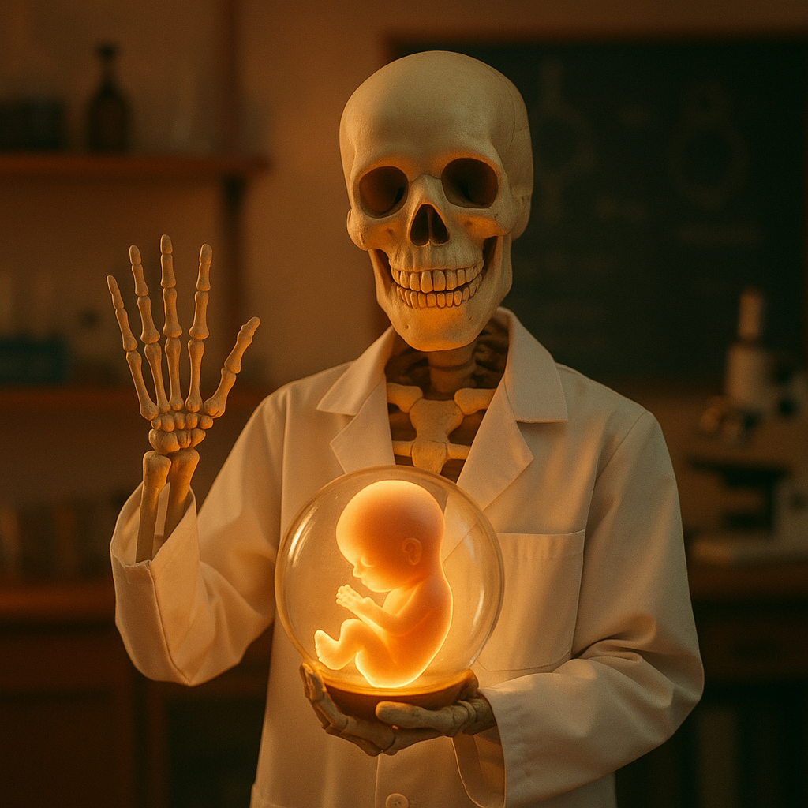

# Anatomia z embriologią

<!-- START: AUTO-GENERATED-OFFICIAL -->
<!-- Auto-generated from data/subjects/anatomia.yml -->
<!-- Last updated: 2025-10-05 20:06 -->
<!-- DO NOT EDIT THIS SECTION MANUALLY -->

  

## 📋 Informacje o przedmiocie

**ECTS:** 14

**Koordynator:** Katedra Anatomii ([anatomia@cm-uj.krakow.pl](mailto:anatomia@cm-uj.krakow.pl))

**Godziny:** Wykłady: 20h, Ćwiczenia: 74h

**Forma zaliczenia:** Egzamin praktyczny i teoretyczny

## 📚 Zasoby MedBox

!!! info "MedBox - Zewnętrzne zasoby"
Poniższe linki prowadzą do materiałów hostowanych na Google Drive (MedBox).
[Więcej o MedBox →](../zasoby/medbox-info.md)

**[📦 Pełny folder MedBox - Anatomia z embriologią](https://drive.google.com/drive/folders/1Lmj3rA5r9ELw4vMoiIEV_lMMmM5t0JP3)**

### 📖 Podręczniki i książki

- **[Bochenek - Anatomia Człowieka](https://drive.google.com/drive/folders/[FOLDER_ID])**
   _Klasyczny polski podręcznik anatomii_
- **[Sobotta Atlas Anatomii Człowieka](https://drive.google.com/drive/folders/[FOLDER_ID])**
   _Atlas anatomiczny (wydanie polskie)_
- **[Netter Atlas of Human Anatomy](https://drive.google.com/drive/folders/[FOLDER_ID])**
   _Atlas anatomiczny (wersja angielska)_

### 📌 Preparaty (egzamin praktyczny)

- **[Zdjęcia preparatów do egzaminu praktycznego](https://drive.google.com/drive/folders/[FOLDER_ID])**
   _Fotografie preparatów z prosektorium z opisami_

### 📅 Harmonogram zajęć - Semestr 1

<table id="harmonogram-table">
  <thead>
    <tr>
      <th>Status</th>
      <th>#</th>
      <th>Data</th>
      <th>Typ</th>
      <th>Temat zajęć</th>
    </tr>
  </thead>
  <tbody>
    <tr data-date="02-03.10.2025">
      <td class="status-cell"></td>
      <td>1</td>
      <td>02-03.10.2025</td>
      <td>🔬 Ćwiczenia</td>
      <td>Wprowadzenie do ćwiczeń prosektoryjnych. Osie, płaszczyzny i okolice ciała ludzkiego. Miana oznaczające położenie i kierunek określonych narządów i tworów. Ogólna budowa kości i ich skład anatomiczny (istota zbita, gąbczasta, okostna, ochrzęstna, szpik kostny, architektonika czynnościowa). Podział kości ze względu na kształt i charakterystyka poszczególnych rodzajów kości. Fizyczne i biologiczne właściwości kości. Rozwój, wzrastanie i czynności kości. Ogólna budowa i rodzaje połączeń ścisłych i wolnych (stawów). Stałe i niestałe składniki stawów. Rodzaje i mechanika stawów.</td>
    </tr>
    <tr data-date="06.10.2025">
      <td class="status-cell"></td>
      <td>2</td>
      <td>06.10.2025</td>
      <td>📚 Wykład</td>
      <td>Wykład: Wstęp do anatomii. Anatomia układu krążenia. Nowe kierunki badań anatomicznych.</td>
    </tr>
    <tr data-date="07-08.10.2025">
      <td class="status-cell"></td>
      <td>3</td>
      <td>07-08.10.2025</td>
      <td>🔬 Ćwiczenia</td>
      <td>Kręgosłup: kręgi szyjne, piersiowe, lędźwiowe, kość krzyżowa, kość guziczna. Połączenia kręgosłupa. Kręgosłup, jako całość. Szkielet klatki piersiowej: żebra, mostek, stawy żebrowo-kręgowe, połączenia żeber z mostkiem. Klatka piersiowa, jako całość.</td>
    </tr>
    <tr data-date="09-10.10.2025">
      <td class="status-cell"></td>
      <td>4</td>
      <td>09-10.10.2025</td>
      <td>🔬 Ćwiczenia</td>
      <td>Szkielet kończyny górnej: obręcz barkowa, obojczyk, łopatka, staw mostkowo-obojczykowy i barkowo-obojczykowy. Kości: ramienna, łokciowa, promieniowa. Stawy: ramienny, łokciowy, promieniowo-łokciowy dalszy. Kości nadgarstka: śródręcza, palców. Stawy: promieniowo-nadgarstkowy i ręki.</td>
    </tr>
    <tr data-date="13.10.2025">
      <td class="status-cell"></td>
      <td>5</td>
      <td>13.10.2025</td>
      <td>📚 Wykład</td>
      <td>Wykład: Wstępne etapy rozwoju człowieka. Gametogeneza. Cykl jajnikowy. Zapłodnienie. Pierwsze etapy rozwoju zarodka. Implantacja. Gastrulacja. Losy listków zarodkowych. Neurulacja.</td>
    </tr>
    <tr data-date="14-15.10.2025">
      <td class="status-cell"></td>
      <td>6</td>
      <td>14-15.10.2025</td>
      <td>🔬 Ćwiczenia</td>
      <td>Szkielet kończyny dolnej: obręcz kończyny dolnej, kość miedniczna, kości: biodrowa, kulszowa i łonowa. Połączenia kości miednicznych między sobą i z kością krzyżową. Miednica, jako całość. Kość udowa. Staw biodrowy.</td>
    </tr>
    <tr data-date="16-17.10.2025">
      <td class="status-cell"></td>
      <td>7</td>
      <td>16-17.10.2025</td>
      <td>🔬 Ćwiczenia</td>
      <td>Piszczel, strzałka, rzepka, staw kolanowy. Szkielet stopy: stęp, kości śródstopia i palców stopy. Stawy: skokowy górny i dolny. Pozostałe stawy stopy. Stopa, jako całość.</td>
    </tr>
    <tr data-date="20.10.2025">
      <td class="status-cell"></td>
      <td>8</td>
      <td>20.10.2025</td>
      <td>📚 Wykład</td>
      <td>Wykład: Wstępne informacje na temat nerwów czaszkowych.</td>
    </tr>
    <tr data-date="21-22.10.2025">
      <td class="status-cell"></td>
      <td>9</td>
      <td>21-22.10.2025</td>
      <td>🔬 Ćwiczenia</td>
      <td>Budowa kości: czołowej, potylicznej, ciemieniowej, klinowej.</td>
    </tr>
    <tr data-date="23-24.10.2025">
      <td class="status-cell"></td>
      <td>10</td>
      <td>23-24.10.2025</td>
      <td>🔬 Ćwiczenia</td>
      <td>Budowa kości skroniowej. Kanały kości skroniowej. Przewód słuchowy zewnętrzny. Ucho środkowe: jama bębenkowa, trąbka słuchowa, jama sutkowa, komórki sutkowe. Ucho wewnętrzne – budowa błędnika kostnego. Kość sitowa.</td>
    </tr>
    <tr data-date="27.10.2025">
      <td class="status-cell"></td>
      <td>11</td>
      <td>27.10.2025</td>
      <td>📚 Wykład</td>
      <td>Wykład: Podstawy diagnostyki obrazowej – wstęp do anatomii radiologicznej.</td>
    </tr>
    <tr data-date="28-29.10.2025">
      <td class="status-cell"></td>
      <td>12</td>
      <td>28-29.10.2025</td>
      <td>🔬 Ćwiczenia</td>
      <td>Doły czaszki: ograniczenia, zawartość, komunikacja. Oczodół, jama nosowa, jama ustna ograniczenia i komunikacja. Miejsca wyjścia nerwów czaszkowych z czaszki.</td>
    </tr>
    <tr data-date="03.11.2025">
      <td class="status-cell"></td>
      <td>13</td>
      <td>03.11.2025</td>
      <td>📚 Wykład</td>
      <td>Wykład: Rozwój ośrodkowego układu nerwowego. Nerwy czaszkowe ze szczególnym uwzględnieniem nerwu trójdzielnego.</td>
    </tr>
    <tr data-date="04-05.11.2025">
      <td class="status-cell"></td>
      <td>14</td>
      <td>04-05.11.2025</td>
      <td>🔬 Ćwiczenia</td>
      <td>Kości twarzoczaszki: szczęka, żuchwa, lemiesz, małżowina nosowa dolna, kość jarzmowa, kość łzowa, kość nosowa, podniebienna, kość gnykowa. Staw skroniowo-żuchwowy. Staw górny i dolny głowy.</td>
    </tr>
    <tr data-date="06-07.11.2025">
      <td class="status-cell"></td>
      <td>15</td>
      <td>06-07.11.2025 <small>Według grafiku grup</small></td>
      <td>⚡ Kolokwium</td>
      <td>⚡ KOLOKWIUM PRAKTYCZNE: Osteologia i czaszka.</td>
    </tr>
    <tr data-date="18.11.2025">
      <td class="status-cell"></td>
      <td>16</td>
      <td>18.11.2025 <small>08:00</small></td>
      <td>⚡ Kolokwium</td>
      <td>⚡ KOLOKWIUM TESTOWE: Kości, czaszka.</td>
    </tr>
    <tr data-date="12-13.11.2025">
      <td class="status-cell"></td>
      <td>17</td>
      <td>12-13.11.2025</td>
      <td>🔬 Ćwiczenia</td>
      <td>Budowa zewnętrzna i wewnętrzna rdzenia kręgowego. ABC układu nerwowego. Opony mózgowia. Zatoki żylne opon mózgowia. Unaczynienie i unerwienie opony twardej.</td>
    </tr>
    <tr data-date="17.11.2025">
      <td class="status-cell"></td>
      <td>18</td>
      <td>17.11.2025</td>
      <td>📚 Wykład</td>
      <td>Wykład: Unaczynienie ośrodkowego układu nerwowego – aspekty kliniczne.</td>
    </tr>
    <tr data-date="18-19.11.2025">
      <td class="status-cell"></td>
      <td>19</td>
      <td>18-19.11.2025</td>
      <td>🔬 Ćwiczenia</td>
      <td>Budowa zewnętrzna i wewnętrzna pnia mózgu. Móżdżek.</td>
    </tr>
    <tr data-date="20-21.11.2025">
      <td class="status-cell"></td>
      <td>20</td>
      <td>20-21.11.2025</td>
      <td>🔬 Ćwiczenia</td>
      <td>Budowa zewnętrzna mózgu. Jądra podkorowe. Układ komorowy. Unaczynienie mózgowia. Drogi piramidowe. Układ pozapiramidowy. Drogi czuciowe.</td>
    </tr>
    <tr data-date="24.11.2025">
      <td class="status-cell"></td>
      <td>21</td>
      <td>24.11.2025</td>
      <td>📚 Wykład</td>
      <td>Wykład: Autonomiczny układ nerwowy. Podstawowe pojęcia dotyczące układu nerwowego (ABC układu nerwowego).</td>
    </tr>
    <tr data-date="25-26.11.2025">
      <td class="status-cell"></td>
      <td>22</td>
      <td>25-26.11.2025</td>
      <td>🔬 Ćwiczenia</td>
      <td>Droga wzrokowa, węchowa, smakowa, słuchowa, równowagi. Układ limbiczny.</td>
    </tr>
    <tr data-date="27-28.11.2025">
      <td class="status-cell"></td>
      <td>23</td>
      <td>27-28.11.2025</td>
      <td>🔄 Powtórki</td>
      <td>Zajęcia powtórkowe.</td>
    </tr>
    <tr data-date="01.12.2025">
      <td class="status-cell"></td>
      <td>24</td>
      <td>01.12.2025</td>
      <td>📚 Wykład</td>
      <td>Wykład: Rozwój serca i układu naczyniowego.</td>
    </tr>
    <tr data-date="02-03.12.2025">
      <td class="status-cell"></td>
      <td>25</td>
      <td>02-03.12.2025</td>
      <td>🔄 Powtórki</td>
      <td>Zajęcia powtórkowe.</td>
    </tr>
    <tr data-date="04-05.12.2025">
      <td class="status-cell"></td>
      <td>26</td>
      <td>04-05.12.2025 <small>Według grafiku grup</small></td>
      <td>⚡ Kolokwium</td>
      <td>⚡ KOLOKWIUM PRAKTYCZNE.</td>
    </tr>
    <tr data-date="08.12.2025">
      <td class="status-cell"></td>
      <td>27</td>
      <td>08.12.2025 <small>08:00</small></td>
      <td>⚡ Kolokwium</td>
      <td>⚡ KOLOKWIUM TESTOWE.</td>
    </tr>
    <tr data-date="09-10.12.2025">
      <td class="status-cell"></td>
      <td>28</td>
      <td>09-10.12.2025</td>
      <td>🔬 Ćwiczenia</td>
      <td>Budowa ściany klatki piersiowej. Sutek – położenie, budowa, unaczynienie, odpływ chłonki. Mięśnie warstwy środkowej i głębokiej: przyczepy, unerwienie, funkcja. Przepona: budowa, unaczynienie, unerwienie, funkcja. Unaczynienie i unerwienie ścian klatki piersiowej. Śródpiersie: podział, ograniczenia. Zawartość śródpiersia przedtchawiczego. Grasica – położenie, budowa, unaczynienie, unerwienie. Naczynia żylne i tętnicze śródpiersia przedtchawiczego. Nerw przeponowy, błędny – przebieg w obrębie kaletki piersiowej, zakres unerwienia w obrębie klatki piersiowej. Tchawica: budowa, położenie, unaczynienie, unerwienie.</td>
    </tr>
    <tr data-date="11-12.12.2025">
      <td class="status-cell"></td>
      <td>29</td>
      <td>11-12.12.2025</td>
      <td>🔬 Ćwiczenia</td>
      <td>Śródpiersie dolne środkowe. Worek osierdziowy. Serce: szczegółowa budowa ściany serca. Szkielet serca. Układ przewodzący serca. Zastawki serca. Tętnice wieńcowe: przebieg, zakres unaczynienia. Naczynia żylne i chłonne serca. Splot sercowy. Rzuty serca, zastawek, miejsca osłuchiwania zastawek. Aorta wstępująca przebieg odgałęzienia.</td>
    </tr>
    <tr data-date="15.12.2025">
      <td class="status-cell"></td>
      <td>30</td>
      <td>15.12.2025</td>
      <td>📚 Wykład</td>
      <td>Wykład: Anatomia echokardiograficzna w praktyce klinicznej.</td>
    </tr>
    <tr data-date="17.12.2025">
      <td class="status-cell"></td>
      <td>31</td>
      <td>17.12.2025</td>
      <td>🔬 Ćwiczenia</td>
      <td>Jama opłucnej. Rodzaje opłucnej. Unaczynienie, unerwienie, rzuty opłucnej. Budowa zewnętrzna i wewnętrzna płuc. Drzewo oddechowe i oskrzelowe. Unaczynienie odżywcze i czynnościowe płuc. Odpływ chłonki i unerwienie płuc. Oddychanie.</td>
    </tr>
    <tr data-date="18-19.12.2025">
      <td class="status-cell"></td>
      <td>32</td>
      <td>18-19.12.2025</td>
      <td>🔬 Ćwiczenia</td>
      <td>Śródpiersie zatchawicze i dolne. Przebieg i odgałęzienia aorty zstępującej. Żyły nieparzyste przebieg, dopływy. Przewód piersiowy, przewód chłonny prawy. Budowa, położenie pnia sympatycznego (współczulnego).</td>
    </tr>
    <tr data-date="08-09.01.2026">
      <td class="status-cell"></td>
      <td>33</td>
      <td>08-09.01.2026</td>
      <td>🔬 Ćwiczenia</td>
      <td>Mięśnie obręczy barkowej. Grupa przednia i tylna mięśni ramienia. Ograniczenia i zawartość dołu pachowego, otworu czworobocznego i trójbocznego. Splot ramienny budowa położenie. Gałęzie krótkie splotu ramiennego. Tętnica podobojczykowa – przebieg, odgałęzienia.</td>
    </tr>
    <tr data-date="12.01.2026">
      <td class="status-cell"></td>
      <td>34</td>
      <td>12.01.2026</td>
      <td>📚 Wykład</td>
      <td>Wykład: Rozwój układu pokarmowego.</td>
    </tr>
    <tr data-date="13-14.01.2026">
      <td class="status-cell"></td>
      <td>35</td>
      <td>13-14.01.2026</td>
      <td>🔬 Ćwiczenia</td>
      <td>Przebieg i zakres unerwienia, objawy uszkodzenia nerwu: pachowego, promieniowego, mięśniowo-skórnego, łokciowego, pośrodkowego, piersiowego długiego, piersiowo-grzbietowego, skórnego przyśrodkowego ramienia i przedramienia. Tętnica pachowa, ramienna, łokciowa, promieniowa – przebieg odgałęzienia. Łuk dłoniowy powierzchowny i głęboki – położenie odgałęzienia. Naczynia żylne powierzchowne i głębokie kończyny górnej. Naczynia i węzły chłonne.</td>
    </tr>
    <tr data-date="15-21.01.2026">
      <td class="status-cell"></td>
      <td>36</td>
      <td>15-21.01.2026</td>
      <td>🔄 Powtórki</td>
      <td>Powtórki. Seminaria: Anatomia kliniczna klatki piersiowej, serca i naczyń w aspekcie zabiegów kardiochirurgicznych, torakochirurgicznych i interwencji przezskórnych w oparciu o badania obrazowe.</td>
    </tr>
    <tr data-date="19.01.2026">
      <td class="status-cell"></td>
      <td>37</td>
      <td>19.01.2026</td>
      <td>📚 Wykład</td>
      <td>Wykład: Anatomia ścian jamy brzusznej w aspekcie przepuklin.</td>
    </tr>
    <tr data-date="22-23.01.2026">
      <td class="status-cell"></td>
      <td>38</td>
      <td>22-23.01.2026 <small>Według grafiku grup</small></td>
      <td>⚡ Kolokwium</td>
      <td>⚡ KOLOKWIUM PRAKTYCZNE: Klatka piersiowa, kończyna górna.</td>
    </tr>
    <tr data-date="26.01.2026">
      <td class="status-cell"></td>
      <td>39</td>
      <td>26.01.2026 <small>08:00</small></td>
      <td>⚡ Kolokwium</td>
      <td>⚡ KOLOKWIUM TESTOWE: Klatka piersiowa, kończyna górna.</td>
    </tr>
    <tr data-date="27-28.01.2026">
      <td class="status-cell"></td>
      <td>40</td>
      <td>27-28.01.2026</td>
      <td>🔬 Ćwiczenia</td>
      <td>Budowa ściany jamy brzusznej. Mięśnie ściany tylnej, bocznej i przedniej. Naczynia tętnicze i żylne, unerwienie, odpływa chłonki ze ściany jamy brzusznej. Jama otrzewnowa. Rodzaje otrzewnej. Zachyłki jamy otrzewnowej.</td>
    </tr>
    <tr data-date="29-30.01.2026">
      <td class="status-cell"></td>
      <td>41</td>
      <td>29-30.01.2026</td>
      <td>🔬 Ćwiczenia</td>
      <td>Aorta brzuszna – położenie odgałęzienia. Żyła główna dolna, żyła wrotna, krezkowa górna i dolna przebieg, dopływy. Splot trzewny. Splot międzykrezkowy, krezkowy dolny, podbrzuszny. Splot lędźwiowy położenie, budowa. Przebieg i zakres unerwienia nerwu biodrowo-podbrzusznego, biodrowo-pachwinowego, płciowo-udowego, zasłonowego.</td>
    </tr>
  </tbody>
</table>

### 🎯 Kolokwia i egzaminy

- [Kolokwium praktyczne - Osteologia i czaszka](kolokwia/semestr-1/anatomia-kolokwia-1) - 06-07.11.2025
- [Kolokwium testowe - Kości, czaszka](kolokwia/semestr-1/anatomia-kolokwia-2) - 18.11.2025
- [Kolokwium praktyczne](kolokwia/semestr-1/anatomia-kolokwia-3) - 04-05.12.2025
- [Kolokwium testowe](kolokwia/semestr-1/anatomia-kolokwia-4) - 08.12.2025
- [Kolokwium praktyczne - Klatka piersiowa, kończyna górna](kolokwia/semestr-1/anatomia-kolokwia-5) - 22-23.01.2026
- [Kolokwium testowe - Klatka piersiowa, kończyna górna](kolokwia/semestr-1/anatomia-kolokwia-6) - 26.01.2026

[➡️ Zobacz wszystkie kolokwia](../kolokwia/index.md)

### 📋 Linki oficjalne

- [📄 Pełny sylabus (PDF)](https://sylabus.cm-uj.krakow.pl/pl/document/9ff824e0-3a92-4c5e-9248-64d1b5df4b3e.pdf)
- [🏛️ Strona katedry](http://anatomia.cm-uj.krakow.pl/)
- [📅 Program zajęć (strona oficjalna)](https://katedra-anatomii.cm-uj.krakow.pl/cm/uploads/2025/09/Lekarski_Harmonogram-2025-26.pdf)

<!-- END: AUTO-GENERATED-OFFICIAL -->

## 💬 Komentarze studentów

!!! tip "Wskazówki"
(Do uzupełnienia - podziel się wskazówkami dla młodszych roczników)

## 🔗 Przydatne linki

- [Strona wydziału](https://wl.cm.uj.edu.pl/)
- [Kenhub - Anatomia online](https://www.kenhub.com/)
- [TeachMeAnatomy](https://teachmeanatomy.info/)
- [Complete Anatomy App](https://completeanatomy.com/)

---

_Pomóż rozwijać tę stronę! Kliknij ikonę ✏️ w prawym górnym rogu, aby dodać materiały._
