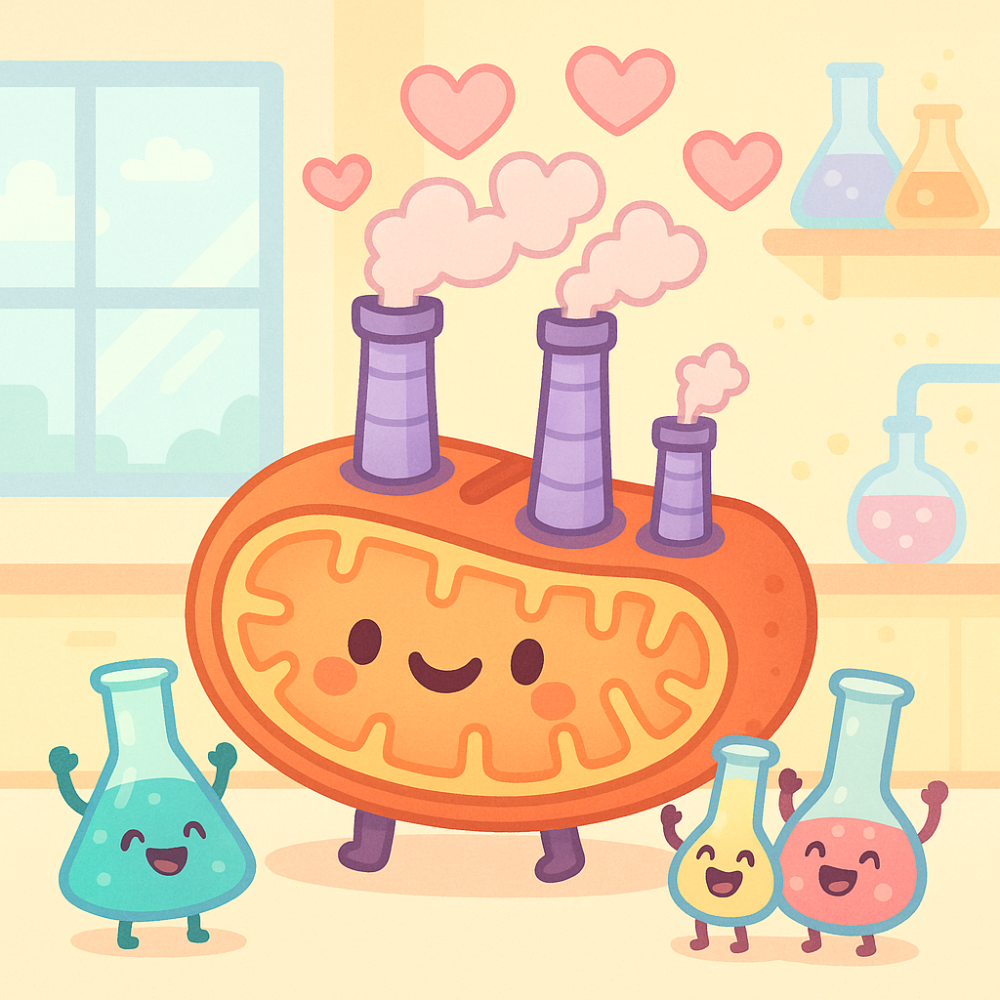

# Biochemia z elementami chemii

<!-- START: AUTO-GENERATED-OFFICIAL -->
<!-- Auto-generated from data/subjects/biochemia.yml -->
<!-- Last updated: 2025-10-05 20:30 -->
<!-- DO NOT EDIT THIS SECTION MANUALLY -->

  

## 📋 Informacje o przedmiocie

**ECTS:** 12

**Koordynator:** Katedra Biochemii ([biochemia@cm-uj.krakow.pl](mailto:biochemia@cm-uj.krakow.pl))

**Godziny:** Wykłady: 26h, Ćwiczenia: 20h, Seminaria: 34h

**Forma zaliczenia:** Egzamin

### 📅 Harmonogram zajęć - Semestr 1

<table id="harmonogram-table">
  <thead>
    <tr>
      <th>Status</th>
      <th>#</th>
      <th>Data</th>
      <th>Typ</th>
      <th>Temat zajęć</th>
    </tr>
  </thead>
  <tbody>
    <tr data-date="03.10.2025">
      <td class="status-cell"></td>
      <td>W1</td>
      <td>03.10.2025 <small>08:30-09:15</small></td>
      <td>📚 Wykład</td>
      <td>📚 Wykład: Biochemia a medycyna - wprowadzenie. prof. Beata Kuśnierz-Cabala (MS Teams)</td>
    </tr>
    <tr data-date="06-10.10.2025">
      <td class="status-cell"></td>
      <td>W2</td>
      <td>06-10.10.2025</td>
      <td>📚 Wykład</td>
      <td>📚 Wykład: Woda jako rozpuszczalnik. Skład płynów ustrojowych. Woda jako reagent - reakcja hydrolizy. Cząsteczki polarne i niepolarne. Błony półprzepuszczalne. Ciśnienie osmotyczne i onkotyczne. Równowagi Donnana. Słabe oddziaływania w roztworach wodnych – wiązania wodorowe, hydrofobowe i van der Waalsa. dr Barbara Stopa (PEGAZ)</td>
    </tr>
    <tr data-date="06-10.10.2025">
      <td class="status-cell"></td>
      <td>Ćw1A</td>
      <td>06-10.10.2025</td>
      <td>🔬 Ćwiczenia</td>
      <td>🔬 Ćwiczenia Grupy A: BHP, roztwory, spektrofotometria. Zasady pracy w laboratorium. Sporządzanie rozcieńczeń wyjściowego roztworu. Nauka pipetowania. Sporządzanie krzywej wzorcowej. Wyznaczanie stężenia roztworu na podstawie krzywej wzorcowej. Zastosowanie spektrofotometrii w badaniach medycznych. Przeliczanie stężeń.</td>
    </tr>
    <tr data-date="13-17.10.2025">
      <td class="status-cell"></td>
      <td>W3</td>
      <td>13-17.10.2025</td>
      <td>📚 Wykład</td>
      <td>📚 Wykład: Równowagi jonowe, równowaga kwasowo-zasadowa. Podstawy homeostazy pH w organizmie człowieka. Roztwory buforowe i ich mechanizm działania. Równanie Hendersona-Hasselbalcha. Bufory biologiczne (bufor wodorowęglanowy, fosforanowy, białczanowy, hemoglobinowy). Proste zaburzenia równowagi kwasowo-zasadowej. Iloczyn rozpuszczalności. dr Barbara Stopa / dr Paulina Dudzik (PEGAZ)</td>
    </tr>
    <tr data-date="13-17.10.2025">
      <td class="status-cell"></td>
      <td>Ćw1B</td>
      <td>13-17.10.2025</td>
      <td>🔬 Ćwiczenia</td>
      <td>🔬 Ćwiczenia Grupy B: BHP, roztwory, spektrofotometria. Zasady pracy w laboratorium. Sporządzanie rozcieńczeń wyjściowego roztworu. Nauka pipetowania. Sporządzanie krzywej wzorcowej. Wyznaczanie stężenia roztworu na podstawie krzywej wzorcowej. Zastosowanie spektrofotometrii w badaniach medycznych. Przeliczanie stężeń.</td>
    </tr>
    <tr data-date="20-24.10.2025">
      <td class="status-cell"></td>
      <td>Ćw2A</td>
      <td>20-24.10.2025</td>
      <td>🔬 Ćwiczenia</td>
      <td>🔬 Ćwiczenia Grupy A: Bufory. Obowiązuje znajomość W2 i W3. Określanie pH roztworów buforowych. Wpływ składu mieszaniny buforowej i rozcieńczenia na możliwości buforowania. Proste obliczenia dotyczące buforów. Zaburzenia równowagi kwasowo-zasadowej – interpretacja wyników gazometrii krwi tętniczej / włośniczkowej.</td>
    </tr>
    <tr data-date="27-30.10.2025">
      <td class="status-cell"></td>
      <td>W4</td>
      <td>27-30.10.2025</td>
      <td>📚 Wykład</td>
      <td>📚 Wykład: Białka I. Struktury I-IV rzędowe białek - podstawy. Wybrane przykłady podstawowych białek, kluczowych dla funkcjonowania organizmu. Białka złożone – metaloproteiny, hemoproteiny. Rola hemoprotein – mioglobina (Mb), hemoglobina (Hb), cytochromy. Struktura i właściwości Mb i Hb – struktura otoczenia hemu, rola reszt His. Krzywe wysycenia Mb i Hb tlenem. Allosteria (struktury T i R), kooperatywność, p50, efektory allosteryczne. Transport dwutlenku węgla, rola anhydrazy węglanowej. Efekt Bohra. Znaczenie 2,3 BPG. Hemoglobina F. Toksyczność CO. dr Barbara Piekarska (PEGAZ)</td>
    </tr>
    <tr data-date="27-30.10.2025">
      <td class="status-cell"></td>
      <td>S1A</td>
      <td>27-30.10.2025</td>
      <td>🔬 Ćwiczenia</td>
      <td>💡 Seminarium Grupy pon-czw: Aminokwasy i białka. Aminokwasy - rodzaje, właściwości, znaczenie dla budowy i funkcjonowania peptydów i białek. Wiązanie peptydowe. Typy interakcji w zależności od rodzaju łańcucha bocznego. Struktura i fałdowanie łańcuchów polipeptydowych – struktury I-IV rzędowe. Domeny, podjednostki. Zmiany pH a konformacja i funkcjonowanie peptydów/białek.</td>
    </tr>
    <tr data-date="27-30.10.2025">
      <td class="status-cell"></td>
      <td>Ćw2B</td>
      <td>27-30.10.2025</td>
      <td>🔬 Ćwiczenia</td>
      <td>🔬 Ćwiczenia Grupy B: Bufory. Obowiązuje znajomość W2 i W3. Określanie pH roztworów buforowych. Wpływ składu mieszaniny buforowej i rozcieńczenia na możliwości buforowania. Proste obliczenia dotyczące buforów. Zaburzenia równowagi kwasowo-zasadowej – interpretacja wyników gazometrii krwi tętniczej / włośniczkowej.</td>
    </tr>
    <tr data-date="03-07.11.2025">
      <td class="status-cell"></td>
      <td>W5</td>
      <td>03-07.11.2025</td>
      <td>📚 Wykład</td>
      <td>📚 Wykład: Białka II. Białka włókienkowe. Składniki macierzy pozakomórkowej. Keratyny. Kolageny - sekwencja a struktura i funkcja. Typy kolagenów. Modyfikacje potranslacyjne -znaczenie hydroksylacji, rola oksydazy lizylowej - wiązania krzyżowe. Zaburzenia struktury kolagenu uwarunkowane genetycznie. Elastyna - struktura, właściwości, rola. Rola fibronektyny i lamininy. Choroby konformacyjne – amyloidozy – właściwości amyloidów. dr Barbara Piekarska (PEGAZ)</td>
    </tr>
    <tr data-date="03-07.11.2025">
      <td class="status-cell"></td>
      <td>S1B</td>
      <td>03-07.11.2025</td>
      <td>🔬 Ćwiczenia</td>
      <td>💡 Seminarium Grupy pt.: Aminokwasy i białka. Aminokwasy - rodzaje, właściwości, znaczenie dla budowy i funkcjonowania peptydów i białek. Wiązanie peptydowe. Typy interakcji w zależności od rodzaju łańcucha bocznego. Struktura i fałdowanie łańcuchów polipeptydowych – struktury I-IV rzędowe. Domeny, podjednostki. Zmiany pH a konformacja i funkcjonowanie peptydów/białek.</td>
    </tr>
    <tr data-date="03-07.11.2025">
      <td class="status-cell"></td>
      <td>Ćw3A</td>
      <td>03-07.11.2025</td>
      <td>🔬 Ćwiczenia</td>
      <td>🔬 Ćwiczenia Grupy A: Aminokwasy i białka. Ocena pI aminokwasów (PTOOLS), chromatografia aminokwasów; widmo albuminy i wyznaczanie stężenia białka w oparciu o absorbancję w UV. Widma hemoglobiny.</td>
    </tr>
    <tr data-date="12-14.11.2025">
      <td class="status-cell"></td>
      <td>S2A</td>
      <td>12-14.11.2025</td>
      <td>🔬 Ćwiczenia</td>
      <td>💡 Seminarium Grupy śr.-pt.: Anemia sierpowatokrwinkowa. Obowiązuje znajomość W4. Molekularne podłoże zaburzeń ogólnoustrojowych na przykładzie anemii sierpowatokrwinkowej. Hemoglobina - struktura a funkcja. Typy łańcuchów globinowych i hemoglobin. Adaptacja do dużych wysokości. Hemoglobiny patologiczne. Talasemie.</td>
    </tr>
    <tr data-date="12-14.11.2025">
      <td class="status-cell"></td>
      <td>Ćw3B1</td>
      <td>12-14.11.2025</td>
      <td>🔬 Ćwiczenia</td>
      <td>🔬 Ćwiczenia Grupy B śr.-czw.: Aminokwasy i białka. Ocena pI aminokwasów (PTOOLS), chromatografia aminokwasów; widmo albuminy i wyznaczanie stężenia białka w oparciu o absorbancję w UV. Widma hemoglobiny.</td>
    </tr>
    <tr data-date="17-21.11.2025">
      <td class="status-cell"></td>
      <td>W6</td>
      <td>17-21.11.2025</td>
      <td>📚 Wykład</td>
      <td>📚 Wykład: Podstawy termodynamiki – funkcje termodynamiczne, prawa termodynamiki, spontaniczność reakcji chemicznej, biologiczny stan standardowy. (1 godz.) dr Barbara Stopa (PEGAZ)</td>
    </tr>
    <tr data-date="17-21.11.2025">
      <td class="status-cell"></td>
      <td>Ćw3B2</td>
      <td>17-21.11.2025</td>
      <td>🔬 Ćwiczenia</td>
      <td>🔬 Ćwiczenia Grupy B pon.-wt.: Aminokwasy i białka. Ocena pI aminokwasów (PTOOLS), chromatografia aminokwasów; widmo albuminy i wyznaczanie stężenia białka w oparciu o absorbancję w UV. Widma hemoglobiny.</td>
    </tr>
    <tr data-date="17-21.11.2025">
      <td class="status-cell"></td>
      <td>W7</td>
      <td>17-21.11.2025</td>
      <td>📚 Wykład</td>
      <td>📚 Wykład: Enzymy. Wprowadzenie do enzymologii. Enzymy jako katalizatory biologiczne. Swoistość i wydajność katalityczna. Klasyfikacja enzymów, podstawowe informacje o koenzymach. Centrum aktywne enzymów. Kompleks enzym-substrat. Mechanizm działania enzymów na wybranych przykładach. dr Marta Kaczor-Kamińska (PEGAZ)</td>
    </tr>
    <tr data-date="17-21.11.2025">
      <td class="status-cell"></td>
      <td>S2B</td>
      <td>17-21.11.2025</td>
      <td>🔬 Ćwiczenia</td>
      <td>💡 Seminarium Grupy pon.-wt.: Anemia sierpowatokrwinkowa. Obowiązuje znajomość W4. Molekularne podłoże zaburzeń ogólnoustrojowych na przykładzie anemii sierpowatokrwinkowej. Hemoglobina - struktura a funkcja. Typy łańcuchów globinowych i hemoglobin. Adaptacja do dużych wysokości. Hemoglobiny patologiczne. Talasemie.</td>
    </tr>
    <tr data-date="24-28.11.2025">
      <td class="status-cell"></td>
      <td>W8</td>
      <td>24-28.11.2025</td>
      <td>📚 Wykład</td>
      <td>📚 Wykład: Nukleozydy i nukleotydy. Oligo- i polinukleotydy - właściwości fizykochemiczne. DNA – struktura, właściwości. Reakcja polimeryzacji oraz hydrolizy kwasu nukleinowego (polimerazy, endo- i egzonukleazy). Cechy genomu pro– i eukariotycznego. Genom człowieka. Replikacja DNA w komórkach prokariotycznych i eukariotycznych. dr Kinga Kocemba-Pilarczyk (PEGAZ)</td>
    </tr>
    <tr data-date="24-28.11.2025">
      <td class="status-cell"></td>
      <td>Ćw4A</td>
      <td>24-28.11.2025</td>
      <td>🔬 Ćwiczenia</td>
      <td>🔬 Ćwiczenia Grupy A: Białka osocza. Charakterystyka frakcji białkowych surowicy. Oznaczenie białka całkowitego w surowicy metodą biuretową. Elektroforeza białek surowicy. Proteinogram – analiza wyników.</td>
    </tr>
    <tr data-date="24-28.11.2025">
      <td class="status-cell"></td>
      <td>S3</td>
      <td>24-28.11.2025</td>
      <td>🔬 Ćwiczenia</td>
      <td>💡 Seminarium: Kinetyka enzymatyczna. Obowiązuje znajomość W6 i W7. Pojęcie Vo, zależność od [S] i [E]. Równanie Michaelisa-Menten. Znaczenie stałej Km. Równanie Lineweavera-Burka. Mechanizmy regulacji aktywności enzymatycznej. Inhibicja reakcji enzymatycznych.</td>
    </tr>
    <tr data-date="01-05.12.2025">
      <td class="status-cell"></td>
      <td>W9</td>
      <td>01-05.12.2025</td>
      <td>📚 Wykład</td>
      <td>📚 Wykład: Budowa, struktura i własności RNA (mRNA, hnRNA, tRNA, rRNA, snRNA, snoRNA, miRNA, scRNA) oraz ich formy występowania. Polimerazy RNA w komórce eukariotycznej i prokariotycznej. Ogólne porównanie przebiegu transkrypcji w komórce prokariotycznej i eukariotycznej. Regulacja transkrypcji. Promotory polimerazy RNA, czynniki transkrypcyjne, sekwencje wzmacniające oraz wyciszające. Szlak interferencji RNA, microRNA. dr Kinga Kocemba-Pilarczyk (PEGAZ)</td>
    </tr>
    <tr data-date="01-05.12.2025">
      <td class="status-cell"></td>
      <td>S4</td>
      <td>01-05.12.2025</td>
      <td>🔬 Ćwiczenia</td>
      <td>💡 Seminarium: Zatrucie inhibitorami esterazy acetylocholinowej. Inhibitory enzymów jako leki.</td>
    </tr>
    <tr data-date="01-05.12.2025">
      <td class="status-cell"></td>
      <td>Ćw4B</td>
      <td>01-05.12.2025</td>
      <td>🔬 Ćwiczenia</td>
      <td>🔬 Ćwiczenia Grupy B: Białka osocza. Charakterystyka frakcji białkowych surowicy. Oznaczenie białka całkowitego w surowicy metodą biuretową. Elektroforeza białek surowicy. Proteinogram – analiza wyników.</td>
    </tr>
    <tr data-date="08-12.12.2025">
      <td class="status-cell"></td>
      <td>W10</td>
      <td>08-12.12.2025</td>
      <td>📚 Wykład</td>
      <td>📚 Wykład: Epigenetyka: metylacja DNA, posttranslacyjne modyfikacje histonów, epigenetyczna regulacja ekspresji genów, piętnowanie genomowe i inaktywacja chromosomu X. Epigenetyka nowotworów. dr Kinga Kocemba-Pilarczyk (PEGAZ)</td>
    </tr>
    <tr data-date="08-12.12.2025">
      <td class="status-cell"></td>
      <td>Ćw5A</td>
      <td>08-12.12.2025</td>
      <td>🔬 Ćwiczenia</td>
      <td>🔬 Ćwiczenia Grupy A: Warsztat 1. Obowiązuje znajomość W8 i W9. Projektowanie eksperymentu naukowego służącego ocenie ekspresji genu na poziomie izoform. Transport białek do miejsca przeznaczenia. Transkrypcja (pojęcie nici kodującej i matrycowej DNA), cechy eukariotycznego mRNA (kodony START i STOP, rejony nie podlegające translacji – UTR), alternatywny splicing – znaczenie. Sekwencje sygnałowe w białkach wydzielanych z komórki. Zasada techniki PCR. Odwrotna transkrypcja – synteza cDNA. Korzystanie z baz danych.</td>
    </tr>
    <tr data-date="10.12.2025">
      <td class="status-cell"></td>
      <td>K1</td>
      <td>10.12.2025 <small>18:00</small></td>
      <td>⚡ Kolokwium</td>
      <td>⚡ KOLOKWIUM 1 (chemia, białka, enzymy)</td>
    </tr>
    <tr data-date="15-19.12.2025">
      <td class="status-cell"></td>
      <td>W11</td>
      <td>15-19.12.2025</td>
      <td>📚 Wykład</td>
      <td>📚 Wykład: Biosynteza białek I. Kod genetyczny. Synteza aminoacylo-tRNA. Interakcja kodon-antykodon. Rybosomy bakteryjne i eukariotyczne. Etapy translacji u eukariota. Porównanie procesu translacji u pro– i eukariota. Regulacja syntezy białka na etapie translacji. Inhibitory procesy translacji u prokariota i ich zastosowanie. Antybiotyki działające na procesy inne niż translacja. Inhibitory procesu translacji u eukariota. Dojrzewanie białek – fałdowanie, modyfikacje potranslacyjne. Glikozylacja białek – typy glikoprotein. Znaczenie. Rola glikozylacji w kierowaniu białek do lizosomów. Acylacje, Hydroksylacje. Karboksylacja zależna od witaminy K i jej znaczenie. Fosforylacja. Modyfikacja przez proteolizę. Wewnątrzkomórkowa degradacja białek. dr Kinga Kocemba-Pilarczyk (PEGAZ)</td>
    </tr>
    <tr data-date="15-19.12.2025">
      <td class="status-cell"></td>
      <td>Ćw5B</td>
      <td>15-19.12.2025</td>
      <td>🔬 Ćwiczenia</td>
      <td>🔬 Ćwiczenia Grupy B: Warsztat 1. Obowiązuje znajomość W8 i W9. Projektowanie eksperymentu naukowego służącego ocenie ekspresji genu na poziomie izoform. Transport białek do miejsca przeznaczenia. Transkrypcja (pojęcie nici kodującej i matrycowej DNA), cechy eukariotycznego mRNA (kodony START i STOP, rejony nie podlegające translacji – UTR), alternatywny splicing – znaczenie. Sekwencje sygnałowe w białkach wydzielanych z komórki. Zasada techniki PCR. Odwrotna transkrypcja – synteza cDNA. Korzystanie z baz danych.</td>
    </tr>
    <tr data-date="15-19.12.2025">
      <td class="status-cell"></td>
      <td>S5</td>
      <td>15-19.12.2025</td>
      <td>🔬 Ćwiczenia</td>
      <td>💡 Seminarium: Mutacje, mechanizmy naprawy uszkodzonego DNA. Obowiązuje znajomość W8. Rodzaje, przyczyny powstawania mutacji. Związki interkalujące, karcynogeny. Systemy naprawy DNA. Rearanżacja genetyczna. Sekwencjonowanie Sangerowskie.</td>
    </tr>
    <tr data-date="22.12.2025-06.01.2026">
      <td class="status-cell"></td>
      <td>PRZERWA</td>
      <td>22.12.2025-06.01.2026</td>
      <td>🔬 Ćwiczenia</td>
      <td>🎄 PRZERWA ŚWIĄTECZNA</td>
    </tr>
    <tr data-date="07-09.01.2026">
      <td class="status-cell"></td>
      <td>Ćw6A1</td>
      <td>07-09.01.2026</td>
      <td>🔬 Ćwiczenia</td>
      <td>🔬 Ćwiczenia Grupy A śr.-czw.: PCR, RT-PCR, elektroforeza DNA i RNA. Analiza wyników reakcji PCR i RT-PCR. Elektroforeza kwasów nukleinowych. Analiza, interpretacja oraz omówienie wyników eksperymentu naukowego przygotowanego w ramach warsztatu nr 1. Analiza wyników reakcji PCR i RT-PCR. Elektroforeza kwasów nukleinowych.</td>
    </tr>
    <tr data-date="12-16.01.2026">
      <td class="status-cell"></td>
      <td>W12</td>
      <td>12-16.01.2026</td>
      <td>📚 Wykład</td>
      <td>📚 Wykład: Podstawy kancerogenezy, geny supresorowe, onkogeny. Transdukcja sygnału i transformacja nowotworowa komórki. dr Dorota Gil (PEGAZ)</td>
    </tr>
    <tr data-date="12-16.01.2026">
      <td class="status-cell"></td>
      <td>Ćw6A2</td>
      <td>12-16.01.2026</td>
      <td>🔬 Ćwiczenia</td>
      <td>🔬 Ćwiczenia Grupy A pon.-wt.: PCR, RT-PCR, elektroforeza DNA i RNA. Analiza wyników reakcji PCR i RT-PCR. Elektroforeza kwasów nukleinowych. Analiza, interpretacja oraz omówienie wyników eksperymentu naukowego przygotowanego w ramach warsztatu nr 1. Analiza wyników reakcji PCR i RT-PCR. Elektroforeza kwasów nukleinowych.</td>
    </tr>
    <tr data-date="12-16.01.2026">
      <td class="status-cell"></td>
      <td>Ćw6B1</td>
      <td>12-16.01.2026</td>
      <td>🔬 Ćwiczenia</td>
      <td>🔬 Ćwiczenia Grupy B śr.-czw.: PCR, RT-PCR, elektroforeza DNA i RNA. Analiza wyników reakcji PCR i RT-PCR. Elektroforeza kwasów nukleinowych. Analiza, interpretacja oraz omówienie wyników eksperymentu naukowego przygotowanego w ramach warsztatu nr 1. Analiza wyników reakcji PCR i RT-PCR. Elektroforeza kwasów nukleinowych.</td>
    </tr>
    <tr data-date="12-16.01.2026">
      <td class="status-cell"></td>
      <td>S6</td>
      <td>12-16.01.2026</td>
      <td>🔬 Ćwiczenia</td>
      <td>💡 Seminarium: HIV. Obowiązuje znajomość W11. Podstawowe metody wykorzystywane w diagnostyce laboratoryjnej.</td>
    </tr>
    <tr data-date="19-23.01.2026">
      <td class="status-cell"></td>
      <td>S7</td>
      <td>19-23.01.2026</td>
      <td>🔬 Ćwiczenia</td>
      <td>💡 Seminarium: CML. Obowiązuje znajomość W12. Molekularne podłoże chorób i terapii: szlaki przekazywania sygnałów w komórce, zaburzenia tych procesów prowadzące do rozwoju nowotworów na przykładzie CML. Cykl komórkowy, proliferacja. Terapie celowane: inhibitory kinaz tyrozynowych w terapii CML.</td>
    </tr>
    <tr data-date="19-23.01.2026">
      <td class="status-cell"></td>
      <td>Ćw6B2</td>
      <td>19-23.01.2026</td>
      <td>🔬 Ćwiczenia</td>
      <td>🔬 Ćwiczenia Grupy B pon.-wt.: PCR, RT-PCR, elektroforeza DNA i RNA. Analiza wyników reakcji PCR i RT-PCR. Elektroforeza kwasów nukleinowych. Analiza, interpretacja oraz omówienie wyników eksperymentu naukowego przygotowanego w ramach warsztatu nr 1. Analiza wyników reakcji PCR i RT-PCR. Elektroforeza kwasów nukleinowych.</td>
    </tr>
    <tr data-date="26-29.01.2026">
      <td class="status-cell"></td>
      <td>Ćw7AB1</td>
      <td>26-29.01.2026</td>
      <td>🔬 Ćwiczenia</td>
      <td>🔬 Ćwiczenia Grupy A i B śr.-czw.: Warsztat 2. Obowiązuje znajomość W10. Wprowadzenie do nowych technik molekularnych (QF-PCR, NGS, analiza zmian epigenetycznych w diagnostyce, CRISPR/Cas9). Znaczenie modyfikacji potranslacyjnej białek w epigenetyce. Podstawy CRISPR/Cas9. Podstawy biochemiczne nowych metod biologii molekularnej.</td>
    </tr>
    <tr data-date="26-29.01.2026">
      <td class="status-cell"></td>
      <td>Ćw7AB2</td>
      <td>26-29.01.2026</td>
      <td>🔬 Ćwiczenia</td>
      <td>🔬 Ćwiczenia Grupy A i B pon.-wt.: Warsztat 2. Obowiązuje znajomość W10. Wprowadzenie do nowych technik molekularnych (QF-PCR, NGS, analiza zmian epigenetycznych w diagnostyce, CRISPR/Cas9). Znaczenie modyfikacji potranslacyjnej białek w epigenetyce. Podstawy CRISPR/Cas9. Podstawy biochemiczne nowych metod biologii molekularnej.</td>
    </tr>
    <tr data-date="30.01.2026">
      <td class="status-cell"></td>
      <td>K2</td>
      <td>30.01.2026 <small>08:30</small></td>
      <td>⚡ Kolokwium</td>
      <td>⚡ KOLOKWIUM 2 (genetyka / biologia molekularna)</td>
    </tr>
  </tbody>
</table>

### 🎯 Kolokwia i egzaminy

- [Kolokwium 1 - Chemia, białka, enzymy](kolokwia/semestr-1/biochemia-kolokwia-1) - 10.12.2025
- [Kolokwium 2 - Genetyka/biologia molekularna](kolokwia/semestr-1/biochemia-kolokwia-2) - 30.01.2026

[➡️ Zobacz wszystkie kolokwia](../kolokwia/index.md)

### 📋 Linki oficjalne

- [📄 Pełny sylabus (PDF)](https://sylabus.cm-uj.krakow.pl/pl/document/[UUID].pdf)
- [🏛️ Strona katedry](http://biochemia.cm-uj.krakow.pl/)
- [📅 Program zajęć (strona oficjalna)](https://biochemia.wl.cm.uj.edu.pl/studenci/organizacja-zajec/biochemia-z-elementami-chemii-1-2-i-rok-kierunek-lekarski/)

<!-- END: AUTO-GENERATED-OFFICIAL -->

## 📋 Informacje ogólne

- **Prowadzący**: [Lista prowadzących](../prowadzacy/index.md)
- **ECTS**: (do uzupełnienia)
- **Rok/Semestr**: Rok I, Semestr (do uzupełnienia)

## 📚 Materiały

### Literatura

!!! note "Polecane podręczniki"
    (Do uzupełnienia - dodaj polecane książki i skrypty)

### Wykłady

#### 2024/2025
(Do uzupełnienia - dodaj linki do wykładów)

#### Archiwum
- [Materiały z poprzednich lat](https://drive.google.com/drive/folders/1SpFEsQDlYYFfqb4o5AEM0aGhNiRsWlTN)

### Ćwiczenia/Seminaria

(Do uzupełnienia - dodaj materiały do ćwiczeń)

### Egzaminy

#### Pytania egzaminacyjne
(Do uzupełnienia - dodaj pytania z ubiegłych lat)

### Kolokwia

(Do uzupełnienia - dodaj materiały do kolokwiów)

## 💬 Komentarze studentów

!!! tip "Wskazówki"
    (Do uzupełnienia - podziel się wskazówkami dla młodszych roczników)

## 🔗 Przydatne linki

- [Oficjalny sylabus UJ CM](https://sylabus.cm-uj.krakow.pl/pl/7/1/7/1/1)
- [Strona wydziału](https://wl.cm.uj.edu.pl/)

---

*Pomóż rozwijać tę stronę! Kliknij ikonę ✏️ w prawym górnym rogu, aby dodać materiały.*
