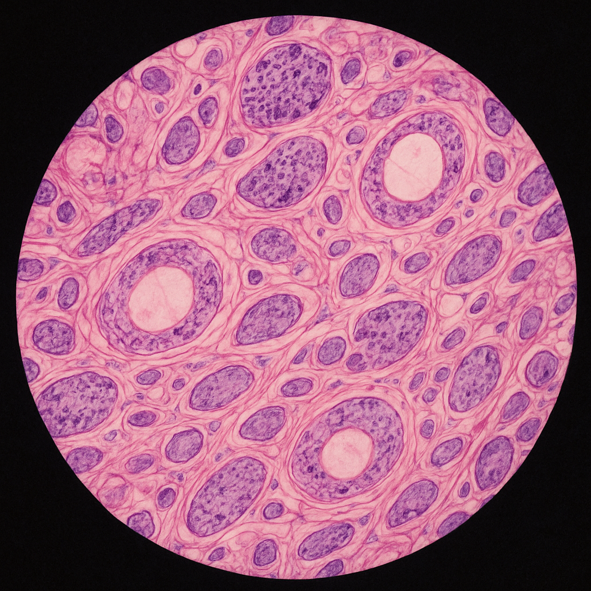

# Histologia z cytofizjologią

<!-- START: AUTO-GENERATED-OFFICIAL -->
<!-- Auto-generated from data/subjects/histologia.yml -->
<!-- Last updated: 2025-10-05 20:21 -->
<!-- DO NOT EDIT THIS SECTION MANUALLY -->

  

## 📋 Informacje o przedmiocie

**ECTS:** 11

**Koordynator:** Katedra Histologii ([histologia@cm-uj.krakow.pl](mailto:histologia@cm-uj.krakow.pl))

**Godziny:** Wykłady: 46h, Ćwiczenia: 54h

**Forma zaliczenia:** Egzamin praktyczny i teoretyczny

## 📚 Zasoby MedBox

!!! info "MedBox - Zewnętrzne zasoby"
    Poniższe linki prowadzą do materiałów hostowanych na Google Drive (MedBox).
    [Więcej o MedBox →](../zasoby/medbox-info.md)

### 📊 Prezentacje z wykładów

- **[Prezentacje z wykładów - Oficjalna chmura UJ](https://chmura.cm-uj.krakow.pl/index.php/s/nHzjizzXrgd9XPQ)**
   *Oficjalne prezentacje z wykładów z histologii*

**[📦 Pełny folder MedBox - Histologia](https://drive.google.com/drive/folders/1N-9TGk01yz2NlL6EgkO9kVTGrA_E5iNS)**

### 🔬 Próbny Egzamin Praktyczny

Przećwicz rozpoznawanie preparatów histologicznych - 9 zestawów egzaminacyjnych po 15 preparatów każdy (3 stoły po 5 preparatów).

  <a href="../testy/histologia-zestaw-1.html" class="quiz-card" style="text-decoration: none;">
    <h4 style="margin-top: 0;">📋 Zestaw 1</h4>
    
15 preparatów • 3 stoły

  </a>
  <a href="../testy/histologia-zestaw-2.html" class="quiz-card" style="text-decoration: none;">
    <h4 style="margin-top: 0;">📋 Zestaw 2</h4>
    
15 preparatów • 3 stoły

  </a>
  <a href="../testy/histologia-zestaw-3.html" class="quiz-card" style="text-decoration: none;">
    <h4 style="margin-top: 0;">📋 Zestaw 3</h4>
    
15 preparatów • 3 stoły

  </a>
  <a href="../testy/histologia-zestaw-4.html" class="quiz-card" style="text-decoration: none;">
    <h4 style="margin-top: 0;">📋 Zestaw 4</h4>
    
15 preparatów • 3 stoły

  </a>
  <a href="../testy/histologia-zestaw-5.html" class="quiz-card" style="text-decoration: none;">
    <h4 style="margin-top: 0;">📋 Zestaw 5</h4>
    
15 preparatów • 3 stoły

  </a>
  <a href="../testy/histologia-zestaw-6.html" class="quiz-card" style="text-decoration: none;">
    <h4 style="margin-top: 0;">📋 Zestaw 6</h4>
    
15 preparatów • 3 stoły

  </a>
  <a href="../testy/histologia-zestaw-7.html" class="quiz-card" style="text-decoration: none;">
    <h4 style="margin-top: 0;">📋 Zestaw 7</h4>
    
15 preparatów • 3 stoły

  </a>
  <a href="../testy/histologia-zestaw-8.html" class="quiz-card" style="text-decoration: none;">
    <h4 style="margin-top: 0;">📋 Zestaw 8</h4>
    
15 preparatów • 3 stoły

  </a>
  <a href="../testy/histologia-zestaw-9.html" class="quiz-card" style="text-decoration: none;">
    <h4 style="margin-top: 0;">📋 Zestaw 9</h4>
    
15 preparatów • 3 stoły

  </a>

### 📅 Harmonogram zajęć - Semestr 1

<table id="harmonogram-table">
  <thead>
    <tr>
      <th>Status</th>
      <th>#</th>
      <th>Data</th>
      <th>Typ</th>
      <th>Temat zajęć</th>
    </tr>
  </thead>
  <tbody>
    <tr data-date="02-03.10.2025">
      <td class="status-cell"></td>
      <td>1</td>
      <td>02-03.10.2025</td>
      <td>🔬 Ćwiczenia</td>
      <td>Wprowadzenie do histologii. Zasady działania mikroskopu optycznego i elektronowego. Charakterystyka obrazu w mikroskopie optycznym, powiększenie, zdolność rozdzielcza. Ogólne zasady przygotowania materiału do badań w mikroskopie optycznym i elektronowym. Charakterystyka podstawowych technik histologicznych. Podstawy histochemii klasycznej, histochemii enzymów, immunocytochemii. Zasady poprawnego mikroskopowania. Komórka, cz. I: Błony biologiczne: składniki błon, ich własności i znaczenie czynnościowe. Transport przez błony biologiczne i jego regulacja. Błona komórkowa, glikokaliks. Jądro – organizacja przestrzenna chromatyny, euchromatyna i heterochromatyna. Jąderko. Zrąb jądra. Otoczka jądrowa i komunikacja jądrowo-cytoplazmatyczna. Struktura rybosomów i przebieg translacji. Siateczka śródplazmatyczna szorstka i gładka. Aparat Golgiego – biegunowość diktiosomu, rola w procesie przebudowy błon, modyfikacji i segregacji białek.</td>
    </tr>
    <tr data-date="06-08.10.2025">
      <td class="status-cell"></td>
      <td>2</td>
      <td>06-08.10.2025</td>
      <td>🔬 Ćwiczenia</td>
      <td>Komórka, cz. II: Egzocytoza. Endocytoza i jej rodzaje, przedziały endosomowe. Lizosomy. Proteasomy. Mitochondria – charakterystyka morfologiczna, własności przedziałów mitochondrialnych, rozmieszczenie układów enzymatycznych i mechanizmy ich działania. Aparat genetyczny i biogeneza mitochondriów. Peroksysomy. Cytoszkielet i mechanizmy zjawisk ruchowych w komórkach. Śmierć komórki: nekroza i apoptoza.</td>
    </tr>
    <tr data-date="09-10.10.2025">
      <td class="status-cell"></td>
      <td>3</td>
      <td>09-10.10.2025</td>
      <td>🔬 Ćwiczenia</td>
      <td>Tkanka nabłonkowa. Ogólna charakterystyka i funkcje nabłonków. Klasyfikacja nabłonków i charakterystyka ich poszczególnych typów. Modyfikacje budowy tkanki nabłonkowej w zależności od pełnionej funkcji. Zróżnicowania powierzchni nabłonków: mikrokosmki i rzęski, mechanizm ruchu rzęsek. Połączenia międzykomórkowe. Blaszka podstawna. Gruczoły – typy budowy i wydzielania.</td>
    </tr>
    <tr data-date="13-15.10.2025">
      <td class="status-cell"></td>
      <td>4</td>
      <td>13-15.10.2025</td>
      <td>🔬 Ćwiczenia</td>
      <td>Tkanka łączna właściwa. Charakterystyka chemiczna i strukturalna substancji międzykomórkowej (włókna i istota podstawowa). Pochodzenie, budowa i czynność komórek tkanki łącznej właściwej: komórki włóknotwórcze, komórki uczestniczące w zjawiskach obronnych. Klasyfikacja odmian tkanki łącznej. Tkanka tłuszczowa.</td>
    </tr>
    <tr data-date="16-17.10.2025">
      <td class="status-cell"></td>
      <td>5</td>
      <td>16-17.10.2025</td>
      <td>🔬 Ćwiczenia</td>
      <td>Tkanki łączne podporowe. Chrząstka: charakterystyka substancji międzykomórkowej, terytoria chrzęstne, typy chrząstki. Elementy składowe kości – substancja międzykomórkowa i komórki: kom. osteogenne, osteoblasty i osteoklasty. Blaszka kostna, organizacja strukturalna i czynnościowa kości gąbczastej i zbitej. Kostnienie na podłożu mezenchymatycznym i chrzęstnym. Wzrost i przebudowa kości. Podstawy procesu biomineralizacji. Budowa stawu.</td>
    </tr>
    <tr data-date="20-22.10.2025">
      <td class="status-cell"></td>
      <td>6</td>
      <td>20-22.10.2025</td>
      <td>🔬 Ćwiczenia</td>
      <td>Krew i hemopoeza. Osocze. Elementy morfotyczne krwi, charakterystyka i przystosowanie do funkcji. Znaczenie granulocytów w procesach obronnych ustroju. Limfocyty, ogólna charakterystyka. Monocyty. Płytki krwi. Budowa szpiku krwiotwórczego. Hemopoeza: komórki macierzyste, linie rozwojowe i ich charakterystyka.</td>
    </tr>
    <tr data-date="23-24.10.2025">
      <td class="status-cell"></td>
      <td>7</td>
      <td>23-24.10.2025</td>
      <td>🔬 Ćwiczenia</td>
      <td>Tkanka mięśniowa. Aparat kurczliwy. Klasyfikacja tkanki mięśniowej. Charakterystyka komórek mięśniowych gładkich, włókien mięśniowych szkieletowych i komórek mięśnia sercowego. Podstawy strukturalne i molekularne zjawiska skurczu w mięśniach gładkich i poprzecznie prążkowanych. Struktura sarkomeru. Budowa i funkcja kanalików T i siateczki sarkoplazmatycznej. Płytka motoryczna. Organizacja błony mięśniowej gładkiej, mięśnia szkieletowego i mięśnia sercowego wraz z układem przewodzącym. Niemięśniowe komórki kurczliwe.</td>
    </tr>
    <tr data-date="27-29.10.2025">
      <td class="status-cell"></td>
      <td>8</td>
      <td>27-29.10.2025</td>
      <td>🔬 Ćwiczenia</td>
      <td>Tkanka nerwowa. Pojęcie neuronu i charakterystyka jego wyposażenia cytoplazmatycznego. Klasyfikacja komórek nerwowych. Włókna nerwowe i ich typy. Strukturalne i molekularne podstawy przewodnictwa nerwowego. Budowa i typy synaps, przewodnictwo synaptyczne. Typy i czynność komórek neurogleju. Pień nerwowy (nerw obwodowy). Zwój międzykręgowy. Ośrodkowy układ nerwowy: skład istoty szarej i białej, organizacja rdzenia kręgowego, kory móżdżku i mózgu.</td>
    </tr>
    <tr data-date="03-05.11.2025">
      <td class="status-cell"></td>
      <td>9</td>
      <td>03-05.11.2025</td>
      <td>🔬 Ćwiczenia</td>
      <td>Układ naczyniowy. Elementy składowe ściany naczyniowej. Śródbłonek, charakterystyka i funkcje. Mechanizmy transportu substancji i migracji leukocytów przez śródbłonek. Angiogeneza. Budowa kapilarów i ich typy. Prekapilary i postkapilary, regulacja przepływu przez łożysko naczyń włosowatych. Naczynia tętnicze: tętnice typu mięśniowego i sprężystego. Naczynia żylne – różnorodność budowy. Anastomozy tętniczo-żylne. Warstwy ściany serca.</td>
    </tr>
    <tr data-date="06-07.11.2025">
      <td class="status-cell"></td>
      <td>10</td>
      <td>06-07.11.2025</td>
      <td>🔬 Ćwiczenia</td>
      <td>Układ limfatyczny. Komórki uczestniczące w reakcjach immunologicznych: komórki prezentujące antygen, limfocyty T i ich subpopulacje, limfocyty B i NK. Odporność nieswoista, receptory rozpoznające wzorzec. Podstawy reakcji immunologicznych: odpowiedź humoralna i komórkowa. Tkanka limfoidalna. Organizacja grudki chłonnej. Węzeł chłonny. Śledziona – organizacja miazgi białej i czerwonej, krążenie śledzionowe. Układ nabłonkowo-limfatyczny grasicy i jej rola jako centralnego narządu limfatycznego. Tkanka limfoidalna błon śluzowych – migdałki.</td>
    </tr>
    <tr data-date="20.11.2025">
      <td class="status-cell"></td>
      <td>K1</td>
      <td>20.11.2025 <small>18:00</small></td>
      <td>⚡ Kolokwium</td>
      <td>⚡ KOLOKWIUM - Cytologia i tkanki (zajęcia 1-10)</td>
    </tr>
    <tr data-date="17-19.11.2025">
      <td class="status-cell"></td>
      <td>11</td>
      <td>17-19.11.2025</td>
      <td>🔬 Ćwiczenia</td>
      <td>Powłoki skórne. Naskórek – keratynocyty i proces rogowacenia, inne komórki obecne w naskórku (melanocyty, komórki Langerhansa i komórki Merkla) i ich funkcje. Organizacja skóry właściwej i tkanki podskórnej. Gruczoły potowe, łojowe i potowe apokrynowe – budowa i mechanizmy wydzielnicze. Korzeń włosa i twory z nim związane. Unaczynienie i unerwienie skóry, typy zakończeń nerwowych i ich rola. Charakterystyka morfologiczna skóry z różnych okolic ciała.</td>
    </tr>
    <tr data-date="24-26.11.2025">
      <td class="status-cell"></td>
      <td>12</td>
      <td>24-26.11.2025</td>
      <td>🔬 Ćwiczenia</td>
      <td>Układ pokarmowy, cz. I. Jama ustna i gruczoły ślinowe. Błona śluzowa różnych rejonów jamy ustnej. Język – brodawki i kubki smakowe, mechanizm percepcji bodźców smakowych. Małe i duże gruczoły ślinowe – budowa i czynność odcinków wydzielniczych i przewodów wyprowadzających. Różnicowa charakterystyka ślinianek. Ogólna budowa zęba: struktura tkanek twardych, miazga zęba, ozębna i dziąsło. Duże gruczoły układu pokarmowego. Trzustka – struktura i funkcja części zewnątrzwydzielniczej, charakterystyka odcinka wydzielniczego, komórki gruczołowej i dróg wyprowadzających. Wątroba – organizacja zrazikowa (zrazik w ujęciu klasycznym i czynnościowym). Charakterystyka strukturalna i czynnościowa komórki wątrobowej i jej biegunów. Zatoki wątrobowe i komórki z nimi związane. Krążenie krwi w wątrobie. Wewnątrz- i zewnątrzwątrobowe drogi żółciowe.</td>
    </tr>
    <tr data-date="01-03.12.2025">
      <td class="status-cell"></td>
      <td>13</td>
      <td>01-03.12.2025</td>
      <td>🔬 Ćwiczenia</td>
      <td>Układ pokarmowy, cz. II. Cewa pokarmowa. Ogólna budowa cewy pokarmowej, charakterystyka warstw ściany. Budowa przełyku. Organizacja błony śluzowej żołądka, charakterystyka nabłonka powierzchniowego, gruczołów i ich skład komórkowy. Jelito i jego przystosowanie do funkcji. Zróżnicowania budowy poszczególnych odcinków jelit. Tkanka limfoidalna cewy pokarmowej. Sploty nerwowe cewy pokarmowej. Komórki dokrewne cewy pokarmowej.</td>
    </tr>
    <tr data-date="08-10.12.2025">
      <td class="status-cell"></td>
      <td>14</td>
      <td>08-10.12.2025</td>
      <td>🔬 Ćwiczenia</td>
      <td>Układ dokrewny. Przysadka mózgowa: część gruczołowa i nerwowa, związek morfologiczny i czynnościowy przysadki z podwzgórzem. Tarczyca: organizacja narządu, struktura pęcherzyka tarczycowego, budowa tworzących go komórek, etapy produkcji hormonów, komórki C. Nadnercze. Kora: podział na warstwy, cechy ultrastrukturalne komórek steroidogennych. Rdzeń: komórki chromochłonne, komórkowe aspekty produkcji katecholamin. Wysepki trzustkowe – typy komórek, ich charakterystyka ultrastrukturalna i czynnościowa. Przytarczyce – budowa, typy komórek i ich czynność. Szyszynka. System rozsianych komórek dokrewnych (DNES). Układ oddechowy. Drogi oddechowe – nabłotek i jego skład komórkowy, charakterystyka błony śluzowej. Jama nosowa: błona śluzowa obszaru oddechowego, błona śluzowa obszaru węchowego i jej nabłonek – budowa i czynność. Budowa tchawicy, oskrzeli i oskrzelików. Organizacja miąższu płucnego. Pęcherzyk płucny: typy pneumocytów i ich funkcje, bariera powietrze-krew, surfaktant i jego rola. Makrofagi płucne i komórki śródmiąższowe.</td>
    </tr>
    <tr data-date="15-17.12.2025">
      <td class="status-cell"></td>
      <td>15</td>
      <td>15-17.12.2025</td>
      <td>🔬 Ćwiczenia</td>
      <td>Układ rozrodczy żeński. Jajnik – organizacja i kolejne stadia rozwoju pęcherzyków jajnikowych. Atrezja pęcherzyków. Ciałko żółte, luteoliza i ciałko białawe. Charakterystyka komórek dokrewnych jajnika. Zrąb jajnika. Jajowód: budowa ściany, charakterystyka nabłonka. Macica: endometrium i myometrium, zmiany błony śluzowej macicy w przebiegu cyklu miesięcznego. Szyjka macicy. Pochwa: budowa ściany, cytologia rozmazów pochwowych. Łożysko – budowa kosmka łożyskowego i charakterystyka bariery łożyskowej. Płyta podstawowa i komórki doczesnowe. Budowa histologiczna błon płodowych i sznura pępowinowego. Gruczoł mlekowy – ogólna charakterystyka budowy, zmienność zależna od fazy rozwoju i stanu czynnościowego. Struktura odcinka wydzielniczego i komórki wydzielniczej, mechanizmy wydzielania składników mleka, budowa przewodów wyprowadzających.</td>
    </tr>
    <tr data-date="16.12.2025">
      <td class="status-cell"></td>
      <td>K1p</td>
      <td>16.12.2025 <small>08:00</small></td>
      <td>⚡ Kolokwium</td>
      <td>⚡ KOLOKWIUM POPRAWKOWE - Cytologia i tkanki</td>
    </tr>
    <tr data-date="12-14.01.2026">
      <td class="status-cell"></td>
      <td>16</td>
      <td>12-14.01.2026</td>
      <td>🔬 Ćwiczenia</td>
      <td>Układ rozrodczy męski. Jądro – kanalik nasienny i jego błona graniczna. „Nabłonek" plemnikotwórczy, spermatogeneza, ultrastruktura plemnika. Komórki Sertolego. Przestrzeń śródmiąższowa jądra: komórki Leydiga, makrofagi jądrowe. Budowa i czynność dróg wyprowadzających: kanaliki proste, sieć jądra, najądrze i nasieniowód. Budowa i czynność gruczołu krokowego, pęcherzyków nasiennych, gruczołów opuszkowo-cewkowych. Układ moczowy. Nerka – obszary miąższu. Charakterystyka nefronu i lokalizacja jego odcinków w obrębie miąższu nerki. Budowa ciałka nerkowego, ultrastruktura i mechanizm działania bariery filtracyjnej. Charakterystyka strukturalna i czynnościowa kolejnych odcinków nefronu. Cewka zbiorcza i jej rola w procesie zagęszczania moczu. Aparat przykłębuszkowy. Układ naczyń krwionośnych w nerce. Drogi moczowe: moczowód, pęcherz moczowy i jego adaptacja do zmiennej pojemności.</td>
    </tr>
    <tr data-date="13.01.2026">
      <td class="status-cell"></td>
      <td>K1o</td>
      <td>13.01.2026 <small>08:00</small></td>
      <td>⚡ Kolokwium</td>
      <td>⚡ KOLOKWIUM OSTATECZNE - Cytologia i tkanki</td>
    </tr>
    <tr data-date="19-21.01.2026">
      <td class="status-cell"></td>
      <td>17</td>
      <td>19-21.01.2026</td>
      <td>🔬 Ćwiczenia</td>
      <td>Narząd wzroku. Ogólna organizacja gałki ocznej, warstwy ściany. Budowa twardówki i rogówki. Naczyniówka właściwa, struktury związane z akomodacją i adaptacją: ciałko rzęskowe, tęczówka i soczewka. Produkcja i krążenie płynu wodnistego. Siatkówka – charakterystyka kolejnych warstw, budowa i czynność fotoreceptorów. Plamka żółta i plamka ślepa. Powieka: spojówka, tarczka i gruczoły. Gruczoł łzowy. Repetytorium praktyczne I.</td>
    </tr>
    <tr data-date="26-28.01.2026">
      <td class="status-cell"></td>
      <td>18</td>
      <td>26-28.01.2026</td>
      <td>🔬 Ćwiczenia</td>
      <td>Demonstracja procedury egzaminu praktycznego. Repetytorium praktyczne II.</td>
    </tr>
  </tbody>
</table>

### 🎯 Kolokwia i egzaminy

- [Kolokwium - Cytologia i tkanki](kolokwia/semestr-1/histologia-kolokwia-1) - 20.11.2025, 18:00
- [Kolokwium poprawkowe - Cytologia i tkanki](kolokwia/semestr-1/histologia-kolokwia-poprawka) - 16.12.2025, 08:00
- [Kolokwium ostateczne - Cytologia i tkanki](kolokwia/semestr-1/histologia-kolokwia-ostateczne) - 13.01.2026, 08:00

- [Egzamin praktyczny I termin](kolokwia/semestr-1/histologia-egzamin-praktyczny-1) - 02-03.02.2026, 09:00-15:00
- [Egzamin teoretyczny I termin](kolokwia/semestr-1/histologia-egzamin-teoretyczny-1) - 05.02.2026, 12:45
- [Egzamin poprawkowy](kolokwia/semestr-1/histologia-egzamin-poprawkowy) - 23.02.2026, 09:00 praktyczny, 10:00 teoretyczny

[➡️ Zobacz wszystkie kolokwia](../kolokwia/index.md)

### 📋 Linki oficjalne

- [📄 Pełny sylabus (PDF)](https://sylabus.cm-uj.krakow.pl/pl/document/[UUID].pdf)
- [🏛️ Strona katedry](http://histologia.cm-uj.krakow.pl/)
- [📅 Program zajęć (strona oficjalna)](https://histologia.cm-uj.krakow.pl/dydaktyka/kierunek-lekarski/kierunek-lekarski-program-i-tematyka-kursu/kierunek-lekarski-program-cwiczen/)

<!-- END: AUTO-GENERATED-OFFICIAL -->

## 💬 Komentarze studentów

!!! tip "Wskazówki"
    (Do uzupełnienia - podziel się wskazówkami dla młodszych roczników)

## 🔗 Przydatne linki

- [Strona wydziału](https://wl.cm.uj.edu.pl/)

---

*Pomóż rozwijać tę stronę! Kliknij ikonę ✏️ w prawym górnym rogu, aby dodać materiały.*
